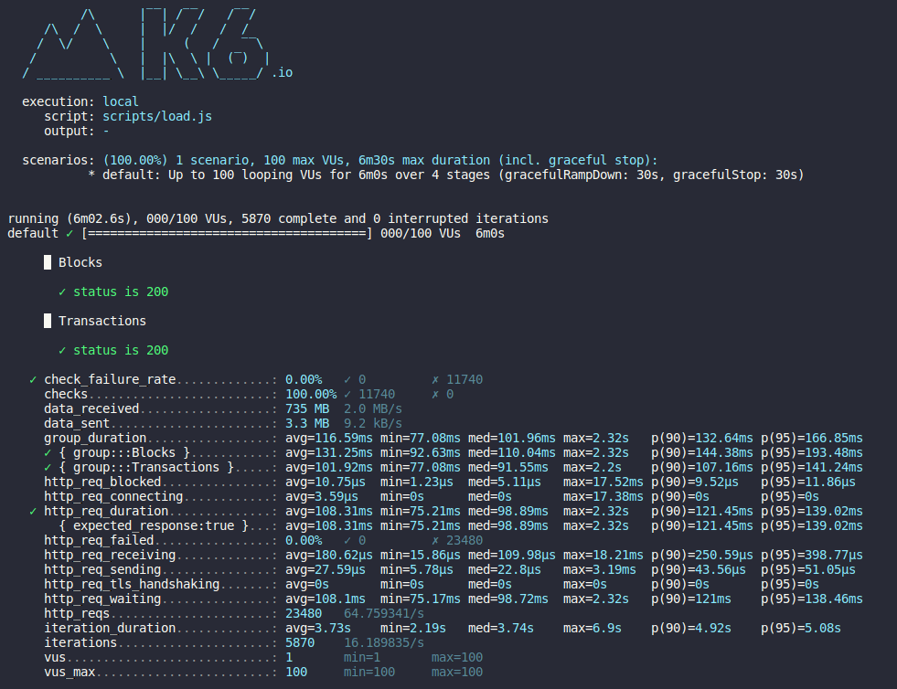

# API Aggregator

The API design is based on two entities: "providers" and "services". The services are the abstraction of the endpoints or routes that expose these services, each implementation made for each "provider" is decoupled from the "services" by the Provider interface.

Among the services currently exposed are:

- Blocks - Allows you to obtain information about the blocks in the blockchain.
- Transactions - Allows you to obtain information about the transactions made in the blockchain.
- Send - Allows you to send transactions to the blockchain

The current strategy is to separate the different methods exposed in the documentation of each provider and group them into "services", which are abstracted into methods that allow the routes for each service to be established and thus allow their activation or deactivation within the API.

Note: In this example the provider used is Infura.

Endpoints:

- GET /v1/block/by/number/{block}/{flag}
- GET /v1/block/by/hash/{block}/{flag}
- GET /v1/tx/by/number/{block}/{index}
- GET /v1/tx/by/hash/{block}/{index}
- POST /v1/send/raw/

## Alpha Version

This is test/example purpose implementation of an API that retrieves Ethereum Mainnet transaction and block data via the INFURA JSON-RPC API. No audited. No security layer is used for this example. DO NOT USE THIS CODE IN PRODUCTION  

### Features

- Only one key.
- Only one auth.
- Multiple service providers support.

## Performance Load Tests

### No-Cache test

```
Stage: 
VUs = Virtual user to run simultaneously
1 - Linearly ramp up from 1 to 100 VUs during first minute.
2 - Hold at 50 VUs for the next 3 minutes and 30 seconds.
3 - Linearly ramp down from 50 to 30 VUs over the last 1 minute.
4 - Linearly ramp down from 30 to 0 VUs over the last 30 seconds.
```

Results based on above conditions:



#### **Conclusions**

The result obtained without the use of any cache is the sum of the api response time + the provider response time.

This test executed for 1 minute the simultaneous load of 100 users (ramp up); then it kept running 50 users for 3m and 30 seconds (ramp down) and then reduced the load to 30 users for 1 minute (ramp down) and finally reduced it to no users connected.

According to the data collected, it can be inferred that the api supports a maximum of 100 simultaneous users with a rate of 100% of 5870 successful executions and an average duration for each request of 108.31ms out of a total of 23480 requests.

Notes:

- Each iteration (tests) was performed in a time interval between 2 and 5 sleep seconds.
- Some of the limitations were the rate limit of the infura free plan.

#### **Recommendations**

1) Using a cache could improve the response time significantly.
2) Using cache could reduce the request rate limit usage from providers.

## References

- Metrics:
<https://k6.io/docs/es/usando-k6/metricas/>
- Infura RPC API:
<https://docs.infura.io/infura/networks/ethereum/json-rpc-methods/>
- Effective Go:
<https://go.dev/doc/effective_go>
- Code Review Comments:
<https://github.com/golang/go/wiki/CodeReviewComments>
- Design Patterns:
<https://sourcemaking.com/design_patterns/strategy>

## Tools

- Load Test: <https://k6.io/docs/>
- Routing: <https://github.com/gorilla/mux>
- Internal RPC calls: <https://github.com/ethereum/go-ethereum>

## Running API

- Install docker: <https://docs.docker.com/get-docker/>

- Set your environment variables: [Check example](./.env.example)

- Compile code using `make compile` command or please check [make file](./Makefile) commands for more details.

- Run the command below in your console:

    ```docker
    docker run -it -p 3333:3333 \
    -v $PWD/bin:/go/bin --entrypoint bin/main-linux-386 \
    --env-file .env --rm --name golang-api golang
    ```

- Run tests:

  - Install k6: <https://k6.io/docs/getting-started/installation/>
  - Run k6: `make load-test`

## Development

Some available capabilities for dev support:

- **Run**: `make run`
- **Build**: `make build`
- **Code Tests**: `make test`
- **Load Tests**: `make load-test`
- **Test Coverage**: `make coverage`
- **Code check**: `make code-check`
- **Code format**: `make code-fmt`
- **Flush cache**: `make clean`

Note: Please check [Makefile](./Makefile) for more capabilities.
